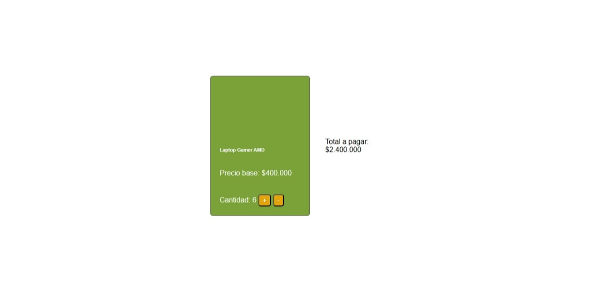

## 🛒 Desafío 1 - Tarjeta de producto interactiva (JavaScript DOM)
📋 Descripción
Este proyecto consiste en una tarjeta de producto para una tienda online, la cual permite incrementar o disminuir la cantidad de productos a comprar y calcula automáticamente el total a pagar. Se utilizaron métodos básicos de JavaScript como querySelector, innerHTML, eventos onClick y manipulación del DOM.

## 🎯 Objetivo del Desafío
Implementar la lógica necesaria para:

Aumentar/disminuir la cantidad de productos.

Calcular el total a pagar.

Aplicar correctamente querySelector() e innerHTML().

Usar onclick para ejecutar funciones al hacer clic en los botones + y -.

## 💻 Tecnologías utilizadas
HTML5

CSS3

JavaScript (DOM y eventos)

## 📁 Estructura del proyecto

├── index.html              # Estructura principal del sitio
├── README.md               # Este archivo
└── assets/
    ├── css/
    │   └── style.css       # Estilos base de la tarjeta
    └── js/
        └── script.js       
        
# Lógica de incremento y cálculo del total
## ⚙️ Funcionamiento
Precio base: $400.000

Cantidad: inicia en 0.

Total a pagar: se actualiza automáticamente según la cantidad seleccionada.

## 🎥 Vista previa:

Producto: Laptop Gamer AMD
[ - ] Cantidad: 2 [ + ]
Total a pagar: $800.000

## 🧠 Lógica implementada

const precio = 400000;
let cantidad = 0;

const precioSpan = document.querySelector(".precio-inicial");
const cantidadSpan = document.querySelector(".cantidad");
const valorTotalSpan = document.querySelector(".valor-total");

const actualizarTotal = () => {
    const total = cantidad * precio;
    valorTotalSpan.innerHTML = total.toLocaleString('es-ES');
};

const incrementar = () => {
    cantidad++;
    cantidadSpan.innerHTML = cantidad;
    actualizarTotal();
};

const disminuir = () => {
    if (cantidad > 0) {
        cantidad--;
        cantidadSpan.innerHTML = cantidad;
        actualizarTotal();
    }
};

precioSpan.innerHTML = precio.toLocaleString('es-ES');

## ✅ Requerimientos cumplidos

 Evento onClick implementado correctamente.

 Uso adecuado de querySelector() e innerHTML().

 Lógica de total a pagar funcional.

 Botones de + y - operativos.

## 📸 Captura del Proyecto

 
## 🚀 Cómo ver el proyecto

git clone https://github.com/Andreadavj/javascript-intro-js.git

## 📌 Autor 

Doris Valverde Jara
Desarrolladora Frontend | Desafío Latam
GitHub